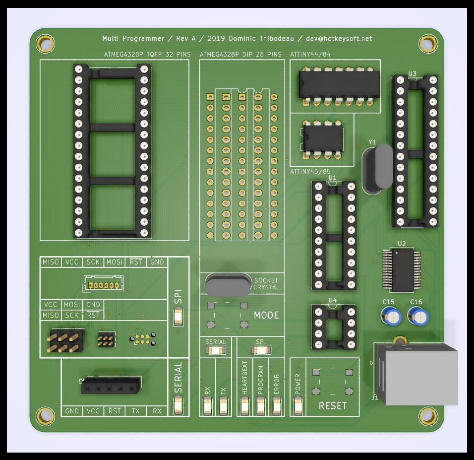
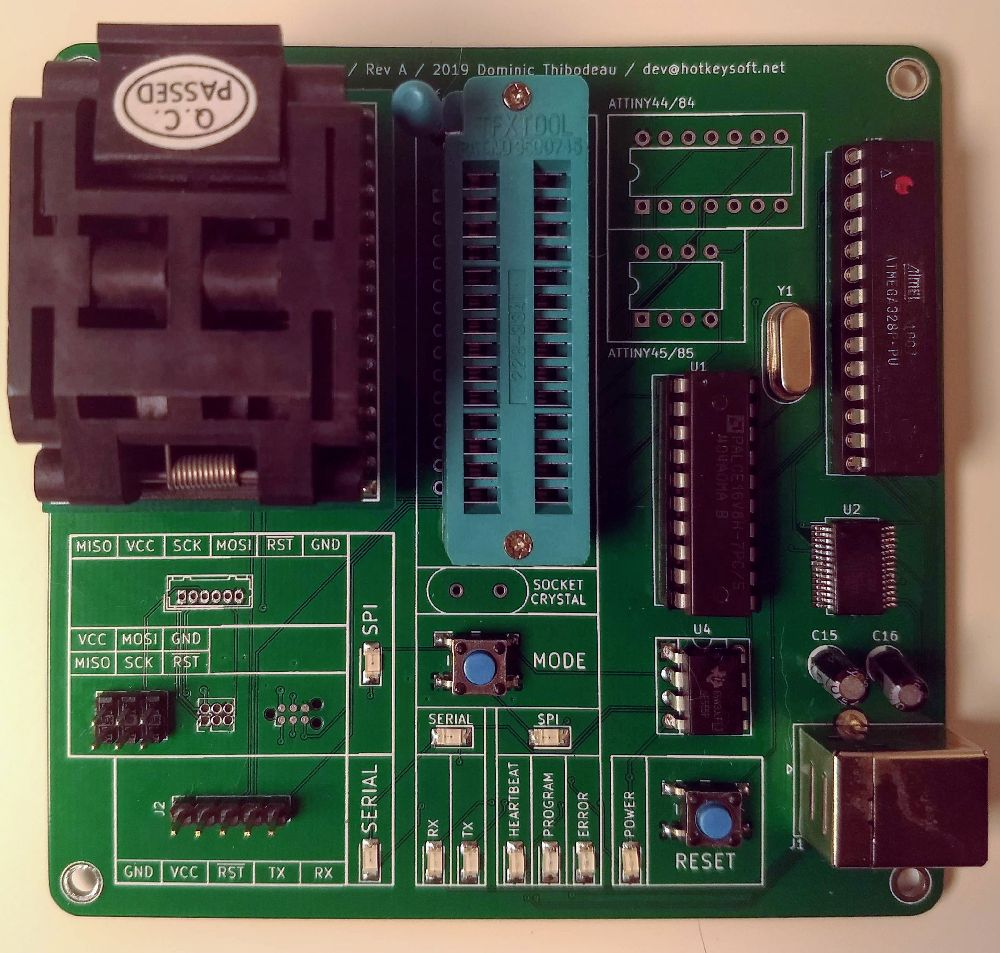
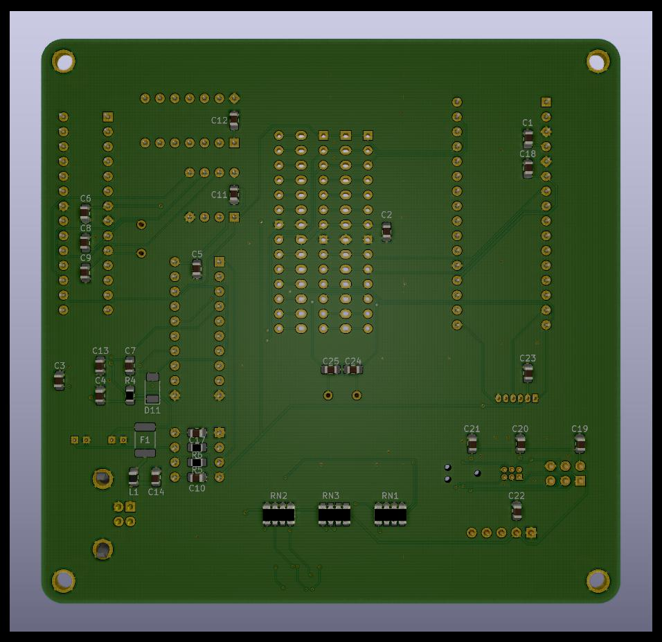
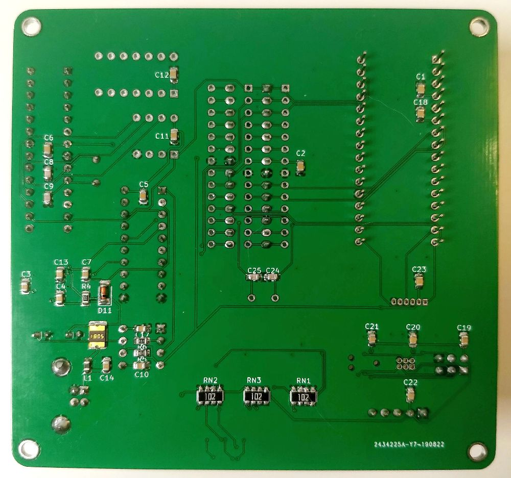

# Multi-Programmer With Serial / SPI Programming
Rev A August 2019

Features
============
- Sockets for direct programming:
	- ATMEGA328P TQFP 32 (via adapter)
	- ATMEGA328P DIP 28 pins
	- ATTINY44/84
	- ATTINY45/85
- Headers for in-circuit programming:
	- Serial Header:
		- 5 pins 2.54mm
	- SPI Headers (too many):
		- 2x3 pins 2.54mm (99% of use)
		- 2x3 pins 1.27mm
		- 1x6 pins 1.25mm (micro-JST)
		- Tag-Connect (mostly useless, since there are no two-ended 
		  Tag-Connect cables. Will be removed in future revisions)
- Two programming modes:
	- Serial passtrough
		- Useful to programm chips with Arduino bootloader, or for any USB<->Serial adapter needs
	- ICSP Programming
		- Compatible with _Arduino as ISP_ programmer in Arduino interface
	- Toggle Serial/ICSP mode with pushbutton switch
- USB-B port (could be a downside but I am fond of them: they are sturdy)

Notes
============
- Socketed chips:
	- _ATmega328P_ running _ArduinoISP_
	- _555_ Used for Mode switch debouncing (old school)
	- _PALCE16V8_ for mode switching logic (LEDs, pin routing) [source](PLD/TTLSW.PDS) 
- Optional crystal socket, not needed for new chips (internal clock is used)
 	- Required for serial programming if the target is set to use an external crystal
	  (Need to confirm if needed in SPI mode)
- Boots in serial mode, be sure to switch mode to use SPI mode
- Reset button resets the target chip (in both modes) and the _Arduino as ISP_ software
- Don't put more than one target chip at a time (undefined behavior, no protection, might destroy the universe)

Images
============

|Render                                                | Real PCB                                       |
|------------------------------------------------------|------------------------------------------------|
|||
|   |   |

### Schematics (pdf)
- [Complete schematics](./img/schema.pdf)

### PCB Images (svg)
- [Top](./img/pcb-front.svg)
- [Bottom](./img/pcb-back.svg)

Future
============
- Try to combine 555 and programmable logic on Arduino
- Remove useless connectors
- Save mode in EEPROM so it is remembered on next power-up
- LEDs are too bright

